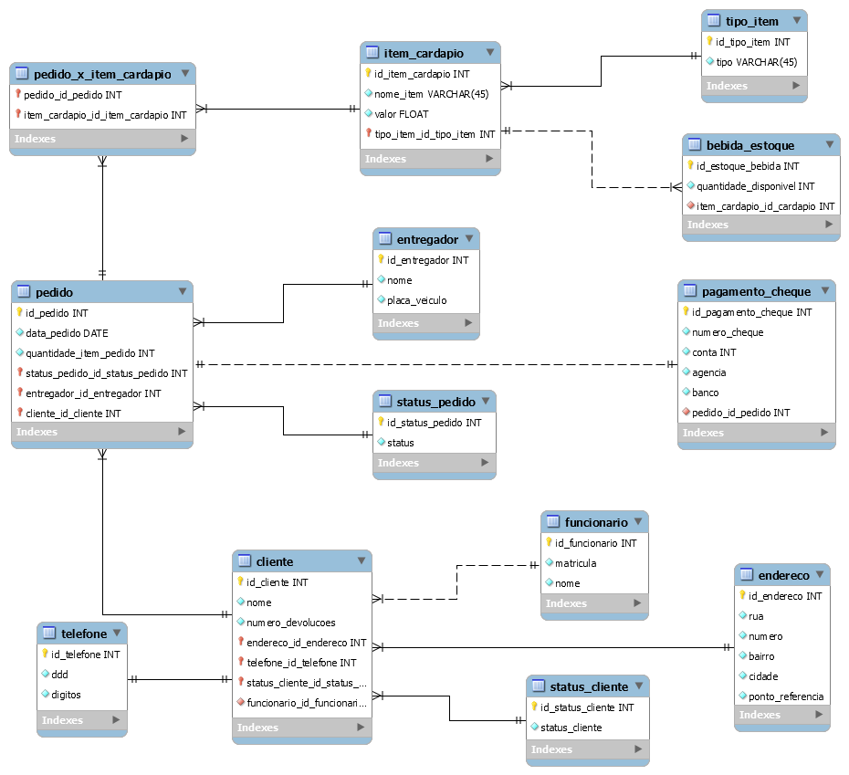

# Disque Rango 

Banco de dados desenvolvido na disciplina de Análise e Projeto de Sistemas para uma empresa fictícia de delivery Disque Rango.

## Regra de negócio

A empresa de entrega de refeições a domicílio Disque-Rango deseja um sistema de informação para melhor atender seus clientes. 

Clientes fazem pedidos, discriminando um ou mais itens de cardápio e suas respectivas quantidades (por exemplo, João faz um pedido para receber em casa 2 lasanhas, 1 filé com fritas e 3 latas de cerveja). De um cliente deseja-se saber: nome, endereço, telefone e ponto de referência.

Itens de cardápio podem ser de três tipos: refeições, sobremesas e bebidas. É necessário saber o nome do item de cardápio e seu tipo e valor, sendo que das bebidas é necessário saber também a quantidade em estoque. Não são aceitos pedidos com quantidades de bebidas superiores às quantidades em estoque. Toda vez que bebidas forem compradas, deve-se atualizar a quantidade em estoque.

Uma vez que um pedido é feito, ele é considerado pendente até que seja passado para um entregador. Quando o entregador retorna com o pagamento, o pedido é considerado atendido. Apenas pedidos ainda pendentes podem ser alterados ou cancelados pelo cliente. No último caso, o pedido é excluído do sistema. Caso o entregador não encontre o cliente em seu endereço e retorne com os produtos, o pedido deve ser considerado devolvido e não deverá ser excluído do sistema. Os clientes com três devoluções de pedidos são desativados e só poderão fazer novos pedidos se forem reativados pelo funcionário.

De um pedido deseja-se saber os itens pedidos, a data, o entregador, o cliente e, caso tenha sido pago em cheque, o número do cheque, conta, agência e banco. De um entregador deseja-se saber nome e placa de seu veículo.

## Modelo Relacional



## Script MySQL

Criação do BD.
```mysql
CREATE DATABASE bd_disque_rango;
```

Declaração de uso do BD a ser manipulado.
```mysql
USE  bd_disque_rango;
```

Criação das tabelas com seus respectivos campos.
```mysql
CREATE TABLE entregador(
    id_entregador INT,
    nome VARCHAR(100) NOT NULL,
    placa_veiculo VARCHAR(8) NOT NULL,
    PRIMARY KEY(id_entregador)
);


CREATE TABLE endereco(
    id_endereco INT,
    rua VARCHAR(45) NOT NULL,
    numero INT NOT NULL,
    bairro VARCHAR(45) NOT NULL,
    cidade VARCHAR(45) NOT NULL,
    ponto_referência VARCHAR(45) NOT NULL,
    PRIMARY KEY(id_endereco)
);


CREATE TABLE telefone(
    id_telefone INT,
    status_cliente VARCHAR(45) NOT NULL,
    PRIMARY KEY(id_telefone)
);


CREATE TABLE status_cliente(
    id_status_cliente INT,
    status_cliente VARCHAR(45) NOT NULL,
    PRIMARY KEY(id_status_cliente)
);


CREATE TABLE funcionario(
    id_funcionario INT,
    matricula VARCHAR(45) NOT NULL,
    nome VARCHAR(100) NOT NULL,
    PRIMARY KEY(id_funcionario)
);


CREATE TABLE cliente(
    id_cliente INT,
    nome VARCHAR(100) NOT NULL,
    numero_devolucoes INT NOT NULL,
    endereco_id_endereco INT NOT NULL,
    telefone_id_telefone INT NOT NULL,
    status_cliente_id_status_cliente INT NOT NULL,
    funcionario_id_funcionario INT NOT NULL,
    PRIMARY KEY(id_cliente),
    FOREIGN KEY(endereco_id_endereco) REFERENCES endereco (id_endereco),
    FOREIGN KEY(telefone_id_telefone) REFERENCES telefone (id_telefone),
    FOREIGN KEY(status_cliente_id_status_cliente) REFERENCES status_cliente (id_status_cliente),
    FOREIGN KEY(funcionario_id_funcionario) REFERENCES funcionario (id_funcionario)
);


CREATE TABLE pedido(
    id_pedido INT,
    data_pedido DATE NOT NULL,
    quantidade_item_pedido INT NOT NULL,
    status_pedido_id_status_pedido INT NOT NULL,
    entregador_id_entregador INT NOT NULL,
    cliente_id_cliente INT NOT NULL,
    PRIMARY KEY(id_pedido),
    FOREIGN KEY(status_pedido_id_status_pedido) REFERENCES status_pedido (id_status_pedido),
    FOREIGN KEY(entregador_id_entregador) REFERENCES entregador (id_entregador),
    FOREIGN KEY(cliente_id_cliente) REFERENCES cliente (id_cliente)
);


CREATE TABLE pagamento_cheque(
    id_pagamento_cheque INT,
    numero_cheque INT NOT NULL,
    conta INT NOT NULL,
    agencia INT NOT NULL,
    banco INT NOT NULL,
    pedido_id_pedido INT NOT NULL,
    PRIMARY KEY(id_pagamento_cheque),
    FOREIGN KEY(pedido_id_pedido) REFERENCES pedido (id_pedido)
);


CREATE TABLE tipo_item(
    id_tipo_item INT,
    tipo VARCHAR(45) NOT NULL,
    PRIMARY KEY(id_tipo_item)
);


CREATE TABLE item_cardapio(
    id_item_cardapio INT,
    nome_item VARCHAR(45) NOT NULL,
    valor FLOAT NOT NULL,
    tipo_item_id_tipo_item INT NOT NULL,
    PRIMARY KEY(id_item_cardapio),
    FOREIGN KEY(tipo_item_id_tipo_item) REFERENCES tipo_item (id_tipo_item)
);


CREATE TABLE pedido_x_item_cardapio(
    pedido_id_pedido INT NOT NULL,
    item_cardapio_id_item_cardapio INT NOT NULL,
    PRIMARY KEY(pedido_id_pedido),
    FOREIGN KEY(pedido_id_pedido ) REFERENCES pedido (id_pedido),
    FOREIGN KEY(item_cardapio_id_item_cardapio ) REFERENCES item_cardapio (id_item_cardapio)
);
```

Exclusão das tabelas.
```mysql
DROP TABLE pedido_x_item_cardapio;
DROP TABLE item_cardapio;
DROP TABLE tipo_item;
DROP TABLE pagamento_cheque;
DROP TABLE pedido;
DROP TABLE cliente;
DROP TABLE funcionario;
DROP TABLE status_cliente;
DROP TABLE telefone;
DROP TABLE endereco;
DROP TABLE entregador;
DROP TABLE status_pedido
```

Exclusão do BD
```mysql
DROP DATABASE bd_disque_rango;
```
